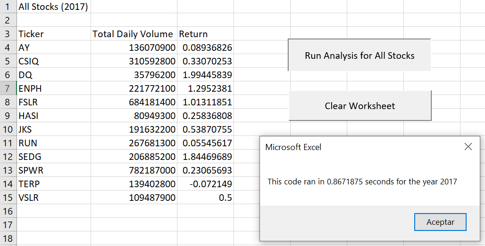
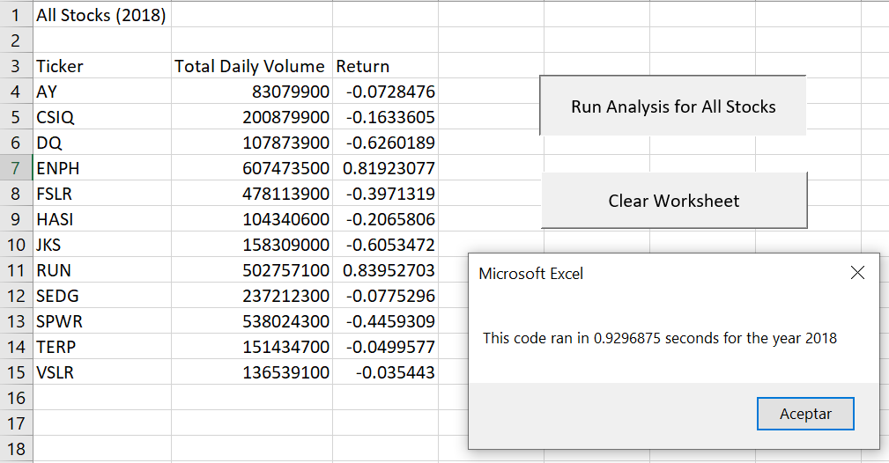
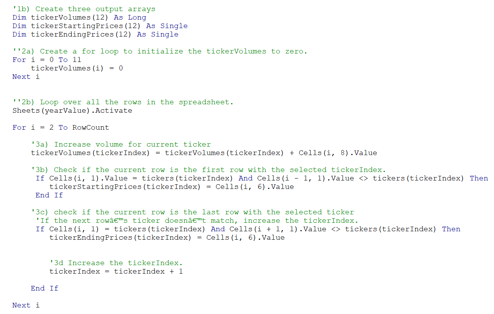
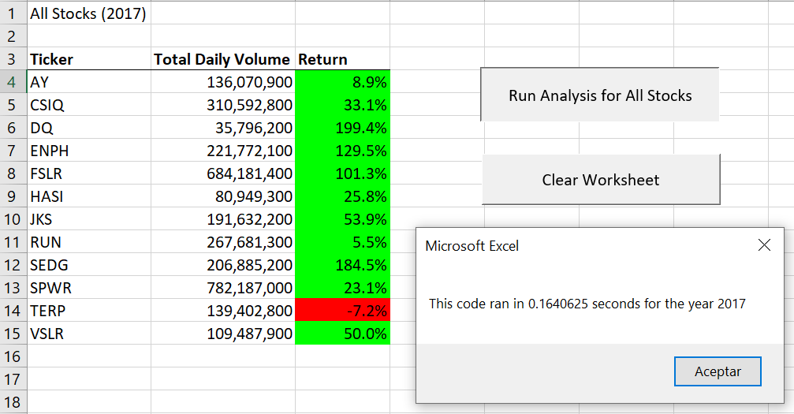
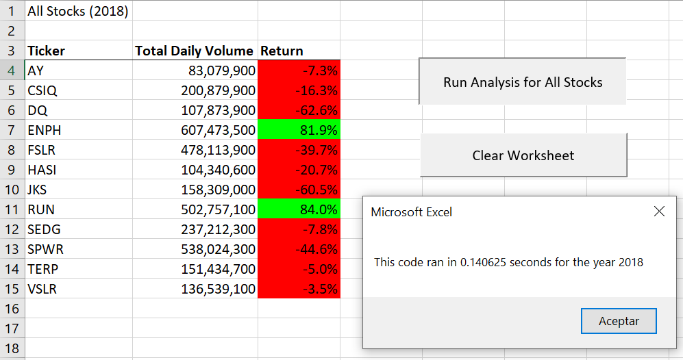

# Stock-Analysis

## Overview of Project
Steve's parents want to invest their money into Daqo New energy Corporation (DQ) that makes silicon wafers for solar panels. Steve asked us to help analyze a green energy stock because he is concerned about diversifying his parent’s funds.

In the first sprint project, we performed this data analysis through Visual Basic for Applications (a.k.a. VBA) so that we were able to write code that automates these analyses for us. Using VBA code to automate tasks decreases the chance of errors and reduces the time needed to run analyses, especially if they need be done repeatedly. The result of this sprint was a workbook where at the click of a button, he can analyze the entire dataset getting the daily volume a return by ticker per year.

Steve wants to expand the dataset including the entire stock market over the last few years. Although our code works well for a dozen stocks, it might not work as well for thousands of stocks. And if it does, it may take a long time to execute and likely it may take a long time to execute.

In this second sprint, we are going to refactor our solution code to loop through all the data one time to collect the same information that we did in the first sprint. Then we will determine whether refactoring our code successfully made our VBA script run faster.

## Results

### Elapsed Time for 2017 and 2018 - sprint 1

The first solution code turns out the following elapsed time results per year:

### Elapsed Time for 2017 and 2018 - sprint 2

In the script refactored, we looped through the data and collected all information in arrays (tickers, tickerVolumes, tickerStartingPrices, and tickerEndingPrices). With the use of “For” loops, the code loop through the arrays to output the “Ticker,” “Total Daily Volume,” and “Return” columns in the spreadsheet “All Stock Analysis”.

Finally, our solution code turns out the elapsed time results per year showed below, so it now runs faster than it did in the first sprint.

## Summary

1.	What are the advantages or disadvantages of refactoring code?
    -	An advantage of refactoring code is to make the code more extensible for adding other functions on it so it could be more flexible. After the refactoring, the code could be easier to read or understand, less complex and easy to maintain. 
    -	A disadvantage of refactoring code is time because we may not have idea how much time it may take to complete the process. There are probable chances that it may go wrong due to complexity of the code

2.	How do these pros and cons apply to refactoring the original VBA script?
    -	A pro of refactoring VBA script is the decrease elapsed time of execution. If Steve had a larger dataset, he could analyze it quickly.
    -	Perhaps, a cons of refactoring VBA script is that it now looks a little elaborate.  
